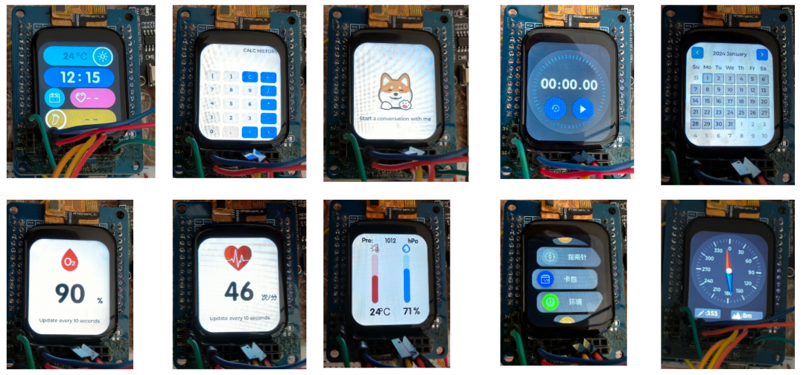

# 前言

一个基于freertos和lvgl的ai智能盒

- 板子：stm32F411ret6、esp32-s3
- hal库
- 模块：具体使用到的模块在：./software/Watch_Lvgl_Freertos/BSP/README.md
- 工具：vscode（platfrom io插件、esp-idf、eide）、keil
- 环境：esp-idf v5.3.3

功能：

- 心率血氧检测
- 步数检测
- 翻转唤醒
- 指南针
- 海拔检测
- 气压检测
- 小游戏（2048）
- 计算器
- ai对话功能
- 语音控制硬件
- 温湿度检测
- nfc（待实现）

- 离线语音控制界面（通过特定指令打开检测界面）

# 项目展示图

仅展示部分图

# 接线

可以直接看提供的部署手册.pdf

# 文件说明

DevelopmentDocuments：相关硬件模块资料

images：存储md文档一些图片

LVGL：基础的lvgl库

software：实际的代码文件

- esp32AI_vscode：esp32-s3相关代码
- Lvgl：codelvgl仿真文件
  - codeblocks：可运行的项目仿真效果
  - codeblocks_template_noused：仿真源代码，可在这里进行设计你的界面
- Watch_Lvgl_Freertos：stm32的相关代码（关键代码，暂不公开，因做毕设会在此基础上拓展）
- esp32AI_vscode：esp32-s3相关代码
- esp32AI助手.hd：天问模块代码

关于一些其它配置，对应的文件夹下，有各自的md文档说明

# ai对话

唤醒：

- 你好小琳：仅启动控制指令

控制指令：

- 关灯
- 开灯

命令：

- 对话：启动ai对话模式 --- 后续可以开始进行对话，如“有什么有趣的事情和我分享吗”

- 退下：关闭对话模式

其余的一些说明可以到各文件夹下查看README文档。
