# 1.sourceinsigt

- sourceinsigt，不用管，本人使用sourceinsight阅读源码创建工程时一些文件的存放处

# 2.Watch_Lvgl_Freertos

Watch_Lvgl_Freertos：项目代码（主要）

```
BSP 		-- 模块驱动代码
Core 		-- 模块初始化文件（stm32cubemx生成，如GPIO初始化）
Drivers		-- 不用管（stm32cubemx生成，hal库文件）
MDK-ARM		-- keil启动存放处
Middlewares	-- 中间件：lvgl和freertos源代码存放处
SYSTEM  	-- 延迟
Test		-- 编写BSP，使用到的测试案例
User		-- GUI、Task实现，硬件接口包装、GUI界面管理实现
```


# 3.Lvgl

仿真案例（codeblock上运行），在codeblocks_template_noused/lvgl下创建一个文件夹，比如user_test，然后将文件夹/Watch_Lvgl_Freertos/User/GUI和/Watch_Lvgl_Freertos/User/Func复制到user_test

之后将Func中的FuncHWDataManage.h：

```
#define HW_USE_HARDWARE 1
更改：
#define HW_USE_HARDWARE 0

```

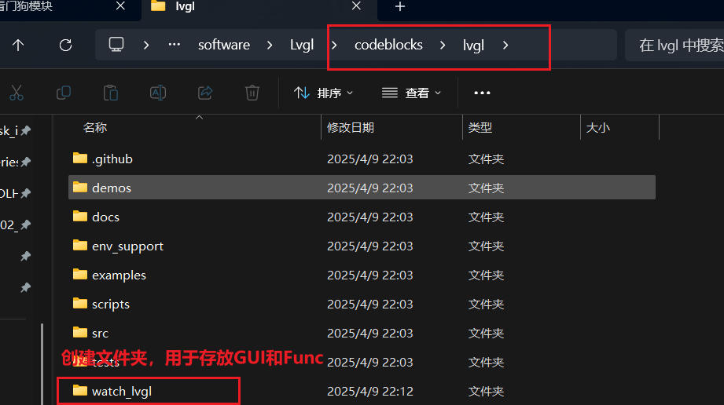

最后就可以打开codeblock开始在GUI文件夹实现GUI界面的代码

注:

- 该文件夹下提供了两个文件夹：
  - codeblocks_template_noused：未使用到的仿真源文件
  - codeblocks：本人实现界面时用到的

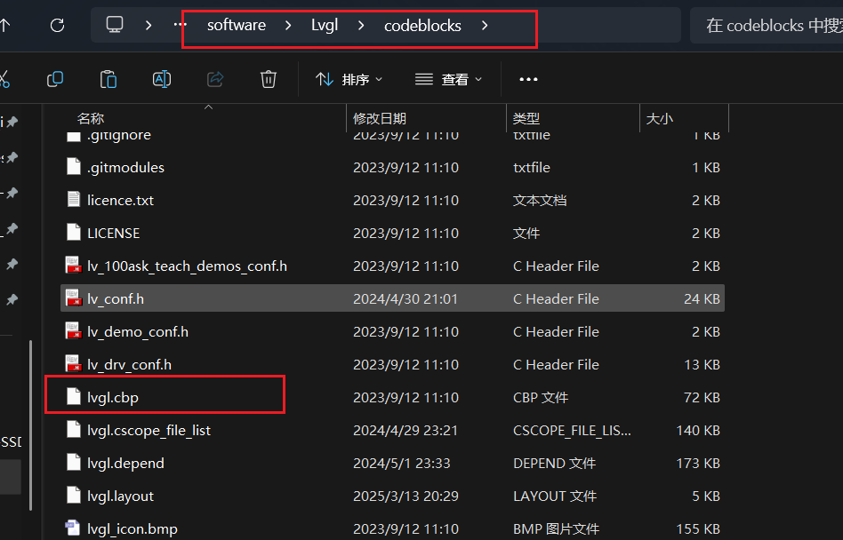

将给文件拖拽到codeblocks打开后：

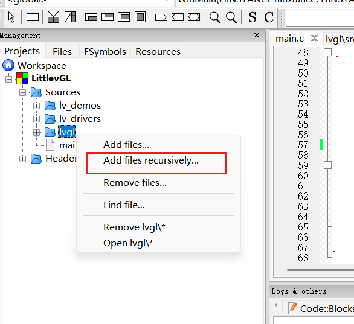

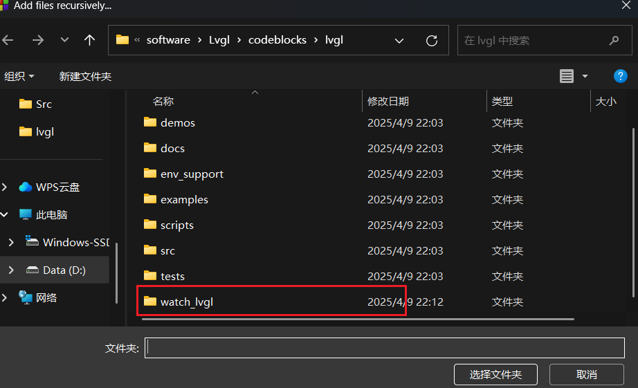

点击后弹出界面选择，不需要点击别的，点击自己创建的用于存放GUI代码的文件夹（我这里是自己创建的watch_lvgl），然后点击选择文件夹，剩下的一路点ok就好了

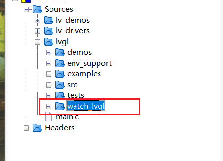

一开始GUI文件夹是空的，可能点击展开后并没有GUI文件夹

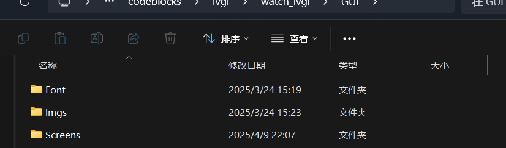

只需要后续在文件管理器，找到GUI文件夹，比如点击Screen/Src，下创建一个.c文件，之后重复上面动作，就可以显示了

另一个注意点，\watch_lvgl and freertos\software\Watch_Lvgl_Freertos\User\GUI/ui.h:

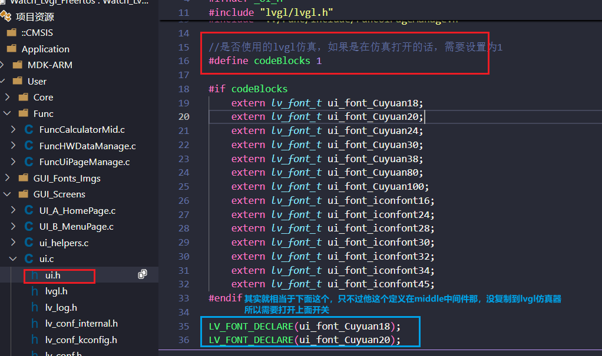

至于像ui_font_iconfont20这些其实就自定义图标，要像使用某一图标，自行去看：[Fonts（字体） — 百问网LVGL中文教程文档 文档](https://lvgl.100ask.net/8.1/overview/font.html#special-fonts)：Add new symbols（添加新符号）处


自定义图标：https://www.iconfont.cn/

编码转换：https://www.cogsci.ed.ac.uk/~richard/utf-8.cgi？

参考：https://blog.csdn.net/mchh_/article/details/146074399


# 4.更新ai

esp32AI_vscode文件夹：存放的是esp32-s3的代码，主要是实现一个ai对话功能（后续想法实现控制硬件的功能）

- vs code插件：platfomr io
- 环境：ESP-IDF v5.3.3
- 模型：使用的讯飞的大模型


## 4.1 配置

去到讯飞官网：https://xinghuo.xfyun.cn/sparkapi   找到控制台创建一个应用

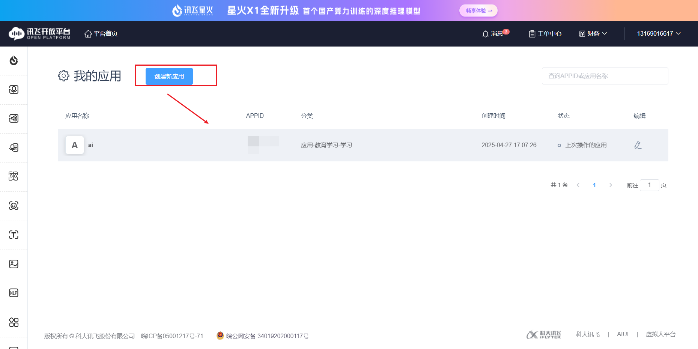

- 创建一个应用

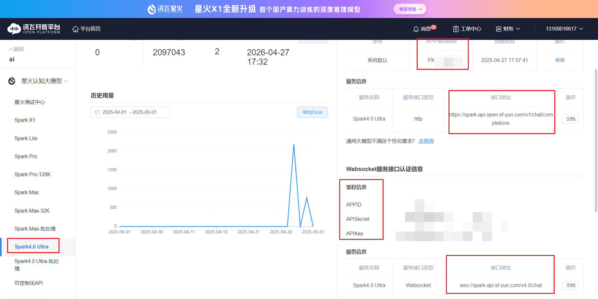

- 选择相应模型，获取对应的鉴权信息和接口地址

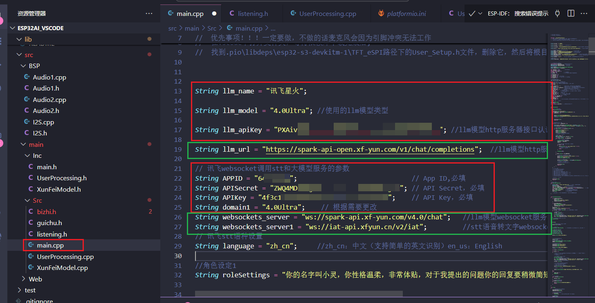

- 将获取到的信息在代码中进行相应的填写，红色框的根据你实际调用的模型提供的llm大模型和websocket进行填写的，绿色的框如果选择的是讯飞，一般不用管
  - 其中，websockets_server1是讯飞提供的stt语音转文字接口
  - 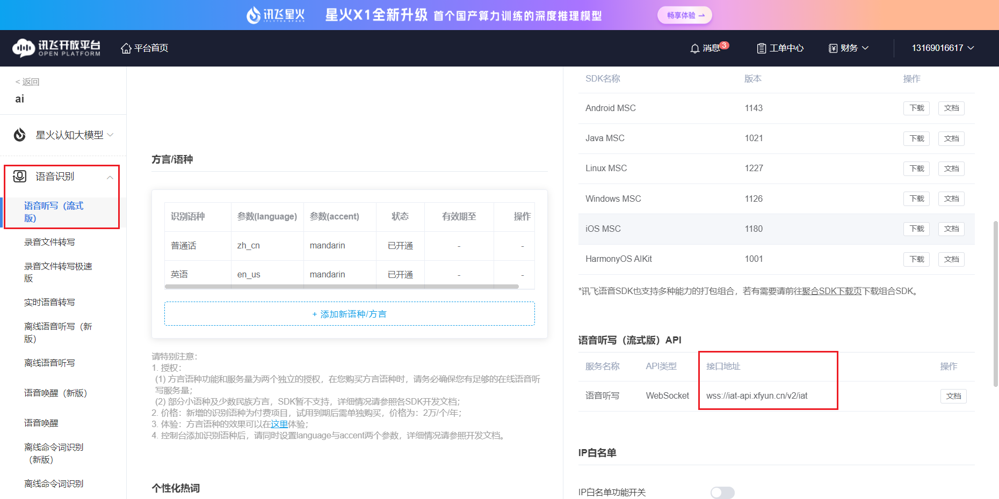


## 4.2 对话流程

### 旧版

大概就是：

启动录音（可以通过唤醒词或者按键唤醒）：

- 通过麦克风录入语音
- 语音传输到讯飞的stt服务器进行解析，将转化为文本的语音内容返回，之后进行判断
  - 为指令：比如“退下”进入待机状态，或者是“关灯”
  - 非指令：调用llm模型接口，将内容传输给llm模型，结果返回，通过语音进行播放，实现对话功能
  - 这个过程有连续对话，也就是会重复进行以上操作

### 新版

由于旧版采用的唤醒方式，需要不断的去监听录音然后连接stt服务器去转文本，检查是否为唤醒词，会导致stt服务资源耗费较多。添加一个ASRPRO天问模块来实现的离线唤醒。

天问模块检测到唤醒词，会通过串口TX发送AA 55 00 55 AA，其中00就是唤醒标识，esp32-s3的loop函数轮询检测串口的RX（GPIO19）是否收到信息，对数据包进行解析出指令0x00，唤醒ai（此时只能做一些控制操作：如开灯关灯）。同时stm32也会接收到该数据，主动打开ai对话界面，保持常量。

要想启动对话模式：需要说“对话”，天问ASRPRO会发送AA 55 03 55 AA，0x03就是启动对话标识，esp32-s3接收到后会启动连续对话模式，开始进行对话。

----

说：<唤醒词>

- 天问发送AA 55 00 55 AA
- stm32串口接收到0x00，跳转到ai对话界面
- esp32-s3串口rx接收到0x00，回应“我在的”，退出待机模式

说：<对话>

- 天问发送AA 55 03 55 AA
- stm32串口接收到0x03，不做任何操作，仅保持屏幕常亮
- esp32-s3串口rx接收到0x03，接下来用户说的话，都会被麦克风模块录入，后会采用websocket的形式调用stt语音转文字对语音进行解析，返回文本。
- 解析到的文本，会采用http流式调用LLM模型，发送提问的文本，后接收解析的LLM模型生成的回答，通过音频播放出来

说：<提问的内容>

- 天问不做处理

- stm32不做处理
- esp32-s3已经开启连续对话模式，接下来说的，会先调用stt将语音转文本，后将文本传输到LLM模型，ai回答后将文本返回，进行播放，实现ai对话

说：<退下>

- 天问发送AA 55 04 55 AA
- stm32串口接收到0x04，退出ai对话界面
- esp32-s3串口rx接收到0x04，关闭连续对话模式，防止说话误调用到LLM模型


## 4.3 唤醒词

### 旧版

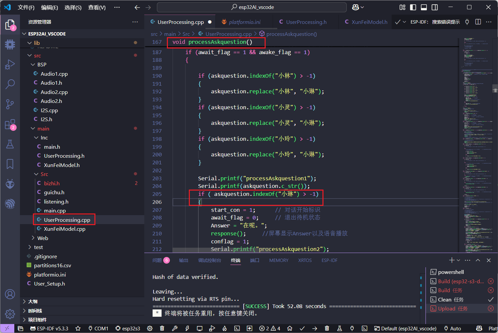

避免识别错误，将多个可能识别的结果替换为实际的目标


### 新版

新版唤醒词采用天问来实现，天问识别到唤醒词，会通过串口发送：AA 55 00 55 AA

- AA 55和55 AA是识别码，中间的00是命令标识，标识我要唤醒esp32-s3的ai对话
- esp32-s3的RX引脚接收到后，会调用processCommand函数进行解析，解析到为0x00，就唤醒
- 同理启动对话模式也是一样，而如果是控制指令，并不会调用到stt和llm，防止资源损耗。

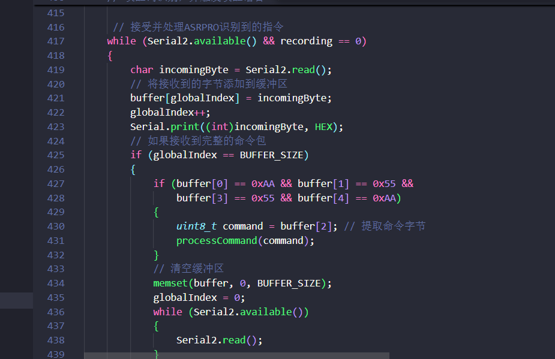

后续流程基本一直：

- 调用stt语音转文字
  - 识别文本是否为开灯关灯一些操作指令，是的话仅播放
  - 不是的话就调用LLM模型，进行连续对话

## 4.4 大致

主要三个文件：

- main.cpp：轮询连续对话
- UserProcessing.cpp：用户发出的语音内容通过stt转化为文本后，对文本进行识别判断
- XunFeiModel.cpp：模型相关，如stt发送和接收，llm模型请求和响应，对串口接收到的数据进行判断（指令还是调用模型）

使用前需要给ESP32-s3配置连接的wifi信息：esp32处于无网状态时，ESP32启动AP模式，创建临时网络热点ESP32-Setup（初始密码为12345678）。手机或电脑连接此网络后，浏览器输入192.168.4.1，出现配置网页界面，通过该网页界面，即可进行网络的配置。


# 5.天问

使用烧录文件：esp32AI助手.hd

具体的去看天问blocks官方的软件：https://www.twen51.com/new/twen51/index.php

该模块主要用来实现唤醒，以及一些常规的控制功能，如开灯、控制界面关闭打开

